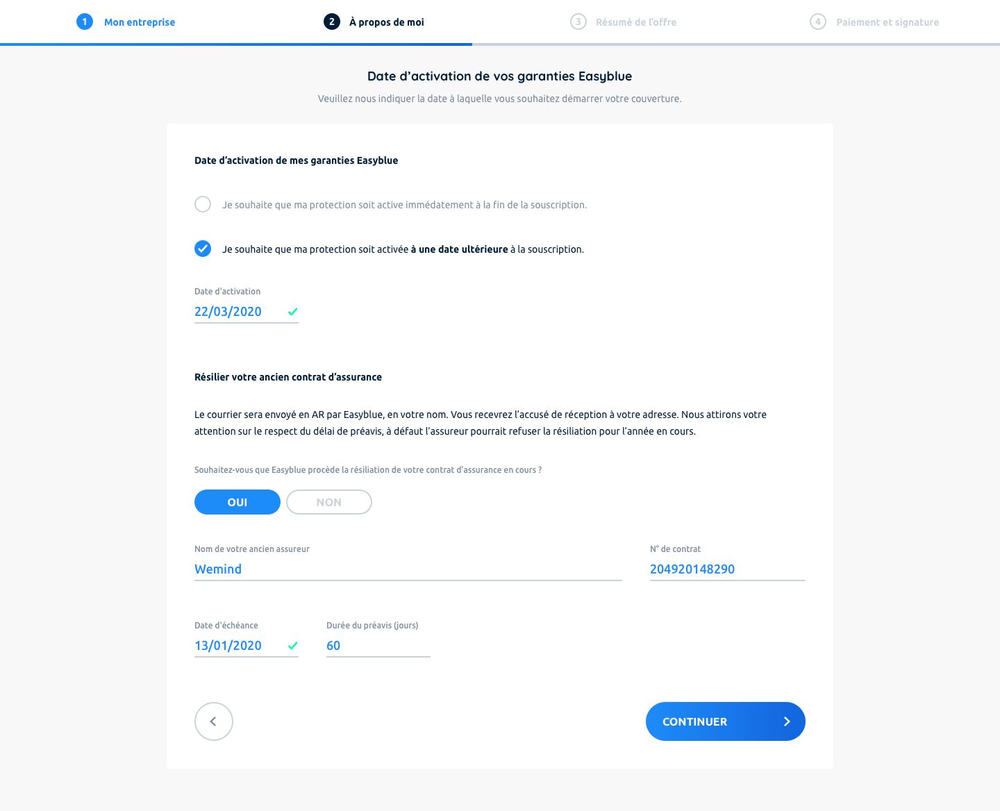

## Object

The objective of this test is to integrate the proposed design into a page using the components of the react.



## Getting Started

First, you need to clone this repository.
Then you have to `cd` into it and `yarn|npm install`;

Now you can run the development server:

```bash
npm run dev
# or
yarn dev
```

Open [http://localhost:3000](http://localhost:3000) with your browser to see the result.

You can start editing the page by modifying `pages/index.js`. The page auto-updates as you edit the file.

